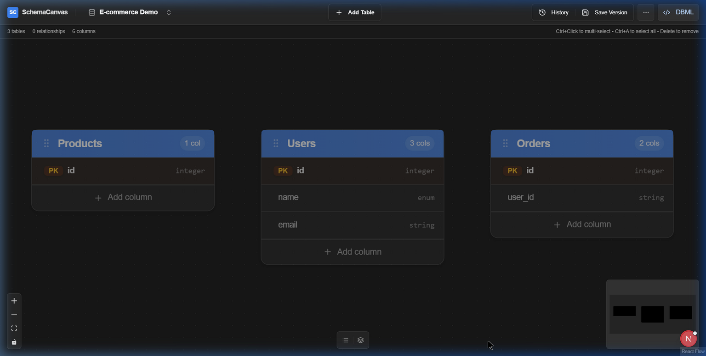
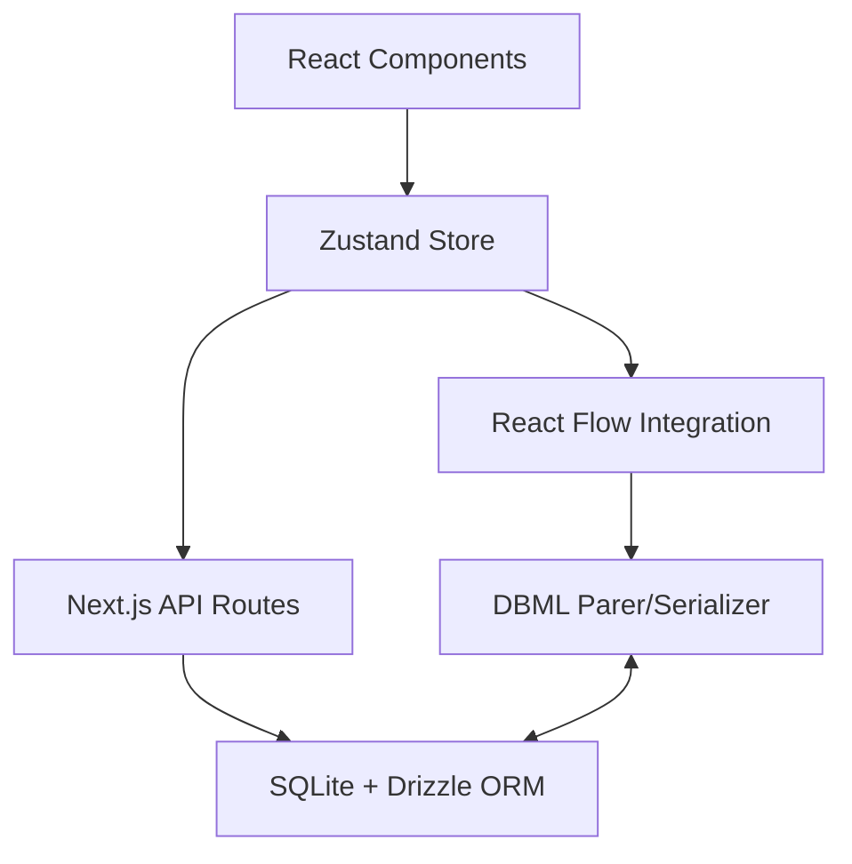

# SchemaCanvas

<div align="center">

**A modern, visual database schema designer built for developers**

[](https://nextjs.org/)
[](https://reactjs.org/)
[](https://www.typescriptlang.org/)
[](LICENSE)

[Features](#-features) • [Preview](#-preview) • [Quick Start](#-quick-start) • [Architecture](#-architecture) • [Shortcuts](#-keyboard-shortcuts)

</div>

## 📑 Table of Contents

- [Overview](#-overview)
- [Preview](#-preview)
- [Core Features](#-core-features)
    - [Advanced Layout Engine](#advanced-layout-engine)
    - [DBML Synchronization](#dbml-synchronization)
- [Architecture](#-architecture)
- [Tech Stack](#-tech-stack)
- [Quick Start](#-quick-start)
- [Keyboard Shortcuts](#-keyboard-shortcuts)
- [Data Types](#-data-types)
- [Roadmap](#-roadmap)

## 🌟 Overview

SchemaCanvas is a professional-grade, visual database schema designer that bridges the gap between interactive design and code. It allows developers to create, edit, and export complex database schemas through an intuitive drag-and-drop interface, while maintaining a real-time bi-directional sync with DBML code.

### Why SchemaCanvas?

- **Zero Friction**: Start designing instantly without complex setup.
- **Developer First**: Focus on the code-to-visual relationship.
- **Native Performance**: Handles hundreds of tables with optimized rendering via React Flow.
- **Local Sovereignty**: Powered by SQLite for private, offline-capable project management.

## 📸 Preview

### Main Canvas


### 💻 Bi-directional DBML Editor


### 📤 Multi-Format Export


### 🌓 Dark & Light Mode


### Key Benefits

- **Visual Design**: Intuitive drag-and-drop canvas for creating database schemas
- **Multi-Format Support**: Export to SQL, Prisma, Django, Laravel, TypeORM, and more
- **Real-time Editing**: Instant visual feedback with inline editing capabilities
- **Framework Agnostic**: Works with any modern database or ORM
- **Responsive Design**: Works seamlessly on desktop and mobile devices
- **Dark Mode**: Full dark/light theme support

## 🚀 Core Features

### Advanced Layout Engine
SchemaCanvas features a sophisticated multi-algorithm layout system to keep your complex diagrams organized:
- **Hierarchical**: Best for visualizing data flow and dependency chains.
- **Force-Directed**: Natural, organic clustering based on relationships.
- **Circular**: Excellent for identifying cyclic dependencies and hubs.
- **Grid / Warehouse**: High-density organization for large schemas.
- **Smart Placement**: Automatically finds the best empty slot for newly added tables.

### 🔄 DBML Synchronization 
Experience real-time bi-directional editing. Change your schema visually on the canvas, and the DBML code updates instantly. Prefer typing? Edit the DBML directly and watch the canvas re-arrange and update in real-time.

### 🛠️ Core Schema Design
- **Interactive Canvas**: Built with React Flow for smooth, performant visual editing.
- **Table & Column Management**: 20+ specialized data types with full constraint support (PK, Unique, Nullable).
- **Visual Relationships**: Drag handles to create Foreign Keys with configurable actions (CASCADE, SET NULL).
- **Multi-Select & Bulk Ops**: Select multiple tables (Ctrl+Click) to move or delete in groups.

## 🏗️ Architecture

SchemaCanvas is built with a focus on local performance and data integrity.



### State Management
We use **Zustand** for lightweight, granular state updates, ensuring that even with hundreds of tables, the UI remains responsive. The state is synchronized with **React Flow** to maintain position data and edge routing.

### Persistence Layer
Your schemas are stored locally in a **SQLite** database managed by **Drizzle ORM**. This provides the reliability of a relational database with the simplicity of a single file in your project directory.

## 💻 Tech Stack

### Frontend & UI
- **Framework**: [Next.js 16.0](https://nextjs.org/) (App Router & Turbopack)
- **Visual Engine**: [@xyflow/react](https://reactflow.dev/) (React Flow)
- **State**: [Zustand](https://github.com/pmndrs/zustand)
- **Styling**: [Tailwind CSS 4](https://tailwindcss.com/)
- **Components**: [Radix UI](https://www.radix-ui.com/) + [Lucide React](https://lucide.dev/)
- **Editor**: [CodeMirror 6](https://codemirror.net/) for DBML

### Backend & Data
- **Database**: [SQLite](https://www.sqlite.org/) (Local)
- **ORM**: [Drizzle ORM](https://orm.drizzle.team/)
- **Package Manager**: [bun](https://bun.sh/) (Recommended)

## ⚡ Quick Start

### 1. Prerequisites
Ensure you have [Bun](https://bun.sh/) or Node.js (v18+) installed.

### 2. Installation & Setup
```bash
# Clone and enter the repo
git clone https://github.com/amaruki/schema-canvas.git
cd schema-canvas

# Install dependencies
bun install

# Initialize the database
bun run db:generate
bun run db:migrate
```

### 3. Run Development Server
```bash
bun run dev
```
Open [http://localhost:3000](http://localhost:3000) in your browser.

## ⌨️ Keyboard Shortcuts

| Shortcut | Action |
|----------|--------|
| `Ctrl + T` | Add New Table |
| `Ctrl + S` | Save Current Version |
| `Ctrl + E` | Open Export Dialog |
| `Ctrl + A` | Select All Tables |
| `Ctrl + D` | Duplicate Selected Table |
| `Ctrl + ,` | Workspace Settings |
| `Delete` | Remove Selected Items |
| `Escape` | Clear Selection / Close Dialogs |
| `Ctrl + Scroll`| Zoom In / Out |

## 📊 Data Types

SchemaCanvas supports a wide range of SQL-compatible and ORM-specific data types:

- **Alphanumeric**: `string`, `text`, `uuid`, `enum`, `array`
- **Numeric**: `integer`, `bigint`, `float`, `decimal`
- **Time-related**: `date`, `datetime`, `timestamp`, `time`
- **Objects**: `json`, `jsonb`
- **Binary**: `binary`
- **Boolean**: `boolean`

## 🛤️ Roadmap

- [ ] **SQL Reverse Engineering**: Import existing databases via SQL dump.
- [ ] **Live Collaboration**: Edit schemas together in real-time.
- [ ] **Custom Templates**: Pre-built schema patterns for SaaS, E-commerce, etc.
- [ ] **AI Assistant**: Generate schemas from natural language descriptions.
- [ ] **Global Export**: Enhanced support for Laravel Migrations and Django Models.

### Export Formats

#### SQL DDL
Generates native SQL CREATE TABLE statements for:
- PostgreSQL (`--dialect=postgresql`)
- MySQL (`--dialect=mysql`)
- SQLite (`--dialect=sqlite`)
- SQL Server (`--dialect=sqlserver`)

#### ORM Schemas
- **Prisma**: Complete schema.prisma with models and relations
- **Django**: Models.py with field types and relationships
- **Laravel**: Migration files with Schema facade
- **TypeORM**: TypeScript entities with decorators

## 🛠️ Project Structure

```bash
src/
├── app/          # Next.js App Router (Routes & Layouts)
├── components/   # Atomic UI & Schema-specific components
├── constants/    # Enums, types, and schema configuration
├── db/           # Drizzle schema & SQLite repositories
├── features/     # Component-specific logic & hooks
├── hooks/        # UI & Canvas interaction hooks
├── lib/          # Layout algorithms & export managers
├── services/     # Core business logic
└── stores/       # Zustand State Management
```

## 🤝 Contributing

We love contributions! Whether it's a bug fix, new feature, or documentation improvement:

1. **Fork** the repository.
2. **Create** your feature branch (`git checkout -b feature/amazing-feature`).
3. **Commit** your changes (`git commit -m 'Add amazing feature'`).
4. **Push** to the branch (`git push origin feature/amazing-feature`).
5. **Open** a Pull Request.

Please ensure your code passes the linter with `bun run lint`.

## 📄 License

This project is licensed under the MIT License - see the [LICENSE](LICENSE) file for details.

## 🧡 Acknowledgments

Special thanks to the open-source community and the creators of **React Flow**, **Drizzle**, and **Zustand** for the incredible tools that make this project possible.

---

<div align="center">

**Built for the community, by the community**

[Star this repo](https://github.com/amaruki/schema-canvas)

</div>